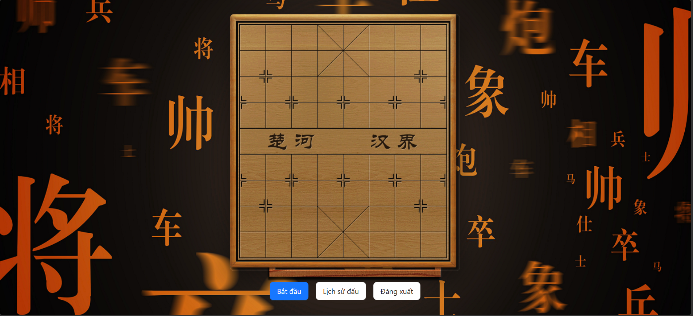
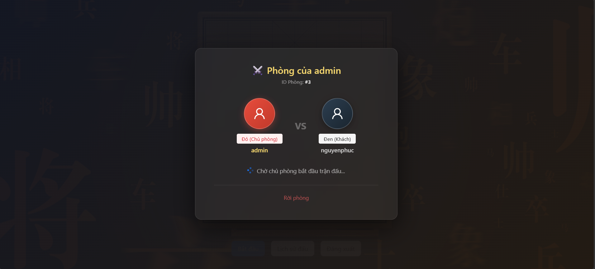
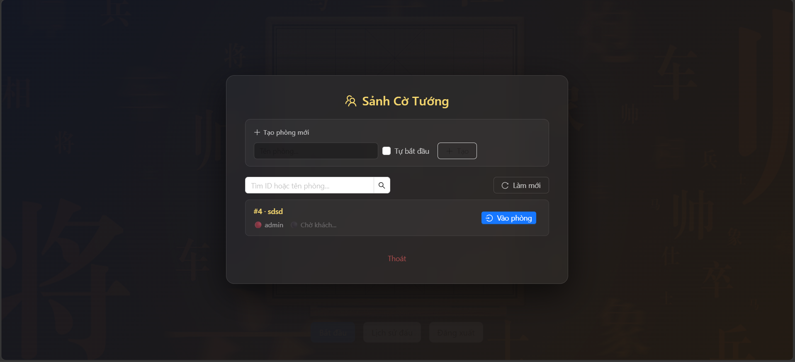
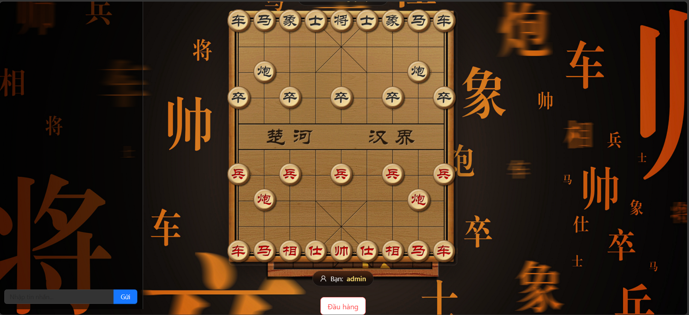
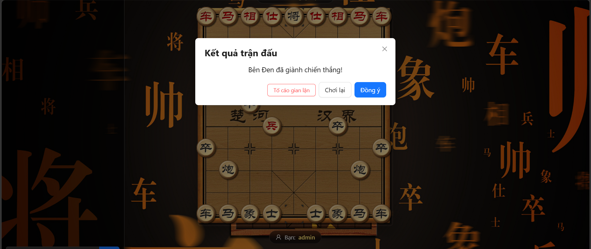
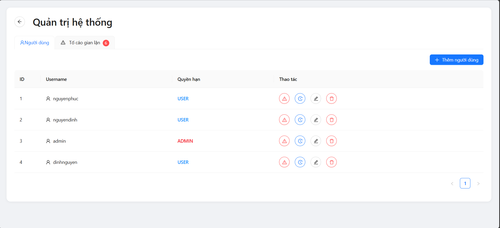

# Chinese Chess Online 

<div align="center">


<br/>
<br/>
<br/>
<br/>
<br/>
<br/>

</div>

---

## Project Structure (Server)

The C++ backend source code is organized following a simplified structure, base on MVC, clearly separating the Routing layer (Handlers) and the Business Logic layer (Services).

```text
server/
├── include/            # Header files (.h)
│   ├── db/             # Database connection & config
│   ├── handlers/       # WebSocket & HTTP routing
│   ├── model/          # Database models definitions
│   ├── network/        # Networking (WebSocket Session, HTTP listeners)
│   ├── service/        # Core business logic (Auth, Room, Game, AntiCheat)
│   ├── type/           # Data structures (Player, RoomState)
│   └── utils/          # Utility functions
├── src/                # Implementation files (.cpp)
│   ├── db/             # Database layer implementation
│   ├── handlers/       # Handlers implementation
│   ├── network/        # Networking implementation
│   └── service/        # Services implementation
├── .dockerignore       # Docker ignore rules
├── Dockerfile          # Production Dockerfile
├── Dockerfile.debug    # Debug Dockerfile
├── docker-compose.yml  # Docker orchestration
├── docker-compose.debug.yml # Debug orchestration
├── env.example         # Environment template
├── CMakeLists.txt      # CMake build configuration
└── main.cpp            # Application entry point
```

---

## Features

1. **Authentication & Authorization (Auth & Roles):** Secure registration and login using JWT. Clear permission separation between regular players (`user`) and administrators (`admin`).
2. **Online Multiplayer (Real-time):** Utilizes WebSockets for matchmaking, room creation, and ultra-low latency real-time move transmission. Includes in-room chat support.
3. **Report System:** Empowers players to report opponents if they suspect cheating or disruptive behavior. Admins can review the complete match history (replay) of reported games.
4. **Anti-Cheat System:** Security checkpoints strictly at the Network and Logic layers prevent hackers from using third-party software to inject or manipulate server traffic.

---

## Report System Workflow

The report feature is designed to handle cases where players purposefully cheat or disrupt the community environment. The operational flow is as follows:

1. **Submitting a Report:** After a match ends, if a player is suspicious, they can click the Report button. The client sends a request containing the `match_id` and the reason for reporting to the server.
2. **Data Logging:** The server records the report into the Database, linking it directly directly to the Match History (`match_history`) and Match Moves (`match_moves`) tables.
3. **Admin Reception:** On the Admin Panel (Reports Tab), administrators can view a dashboard of the latest submitted reports.
4. **Investigation (Replay Validation):** Clicking on a report automatically fetches the entire match history and triggers a "Replay". The Admin can manually review the game move-by-move to detect signs of algorithmic bot usage.
5. **Taking Action (Punishment):** If a violation is confirmed, the Admin can quickly apply penalties directly through the system interface: **Mute Chat**, **Ban Room Creation**, or completely **Ban Account** for a specified number of days.

---

## Backend Anti-Cheat System


Security mechanisms include:

*   **Move Flood Detection:** Recognizing that Chinese Chess is strictly turn-based, the system continuously monitors a rolling time window. If a single client sends more than 2 move actions within 1 second, the packet is instantly dropped, accompanied by a "Move flood detected" warning.
*   **Same-type Spam Guard:** Attackers might utilize tools to aggressively spam massive quantities of the same packet (e.g., `search_room`). If the server detects > 8 consecutive identical packet types, it performs a silent drop, leaving the bot unaware and unable to adjust to bypass the filter.
*   **Payload Sanity Check:** Rigorous formatting validation to prevent engine crashes:
    *   Hard limit on `chat` message length (≤ 300 characters) to prevent Buffer Overflow and Chat Flooding.
    *   Forces the `roomId` payload to be a true String, nullifying Type Confusion exploit attempts.
    *   Only allows specific, legitimate values for the game outcome ("win", "lose", "draw").
*   **Instant-Win Fraud Protection:** When a client sends a signal declaring checkmate (A Win), the server does not blindly trust it. Instead, the server cross-checks its own internal counter: `server_move_count`. If the victor tries to declare a win when the server-tracked move count is < 3 moves (which is theoretically impossible in real chess), this fraudulent victory claim is immediately rejected.
*   **Post-Game Behavior Metrics:** After every match concludes, the system analyzes the pacing of the game. If a match ends incredibly quickly (< 5s) or the move execution speed exceeds human limits (> 120 moves/min), the Server logs a Suspicion Score alert, flagging the account for administrative investigation.
